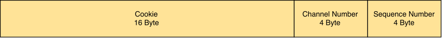
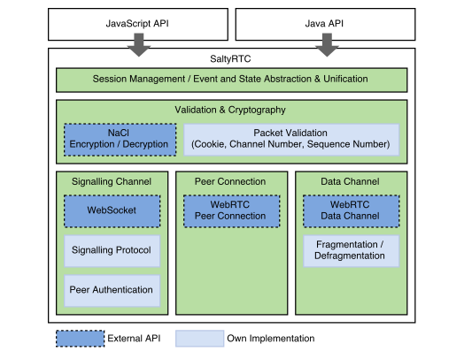
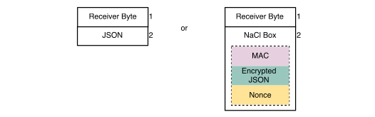
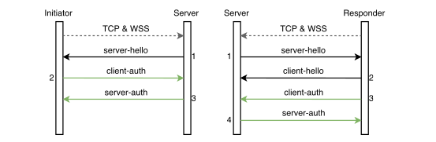
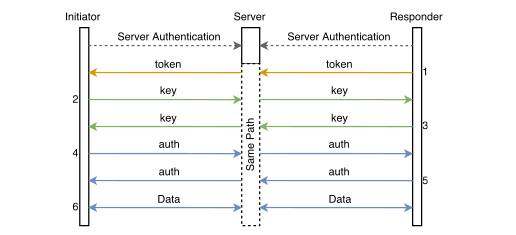

# SaltyRTC - Secure WebRTC based on NaCl

## Introduction

SaltyRTC is a software collection that has been written to set up and provide a secure WebRTC data channel even when the underlying DTLS encryption of the peer connection or the TLS encryption of the signalling implementation is completely broken. This ensures that we have a countermeasure for every possible vulnerability of DTLS or TLS.

In addition, SaltyRTC provides authentication for WebRTC peers. Moreover, SaltyRTC does not trust and does not need to trust the signalling server. Data exchanged on the signalling channel can only be read by the peers. The server has no way to manipulate data undetected. We consider this a major advantage over other signalling implementations.

All authentication is done by challenges for NaCl key pairs and a NaCl secret key that is used once. Only 64 bytes need to be exchanged over a separate channel: The public NaCl key (32 bytes) and a secret key (32 bytes) of the peer who initiates the connection. While the public key can be exchanged over an unprotected channel, the secret key must be exchanged over a secure channel. The channel itself has to be provided by the developer. Moreover, the peers may store the public key of each others peer as a *trusted key*. In that case, further communication can be established without the need of a secure channel.

## Terminology

### Permanent Key

The permanent key is a NaCl key pair for public key authenticated encryption. Each peer generates a permanent key.

### Authentication Token

An authentication token consists of a NaCl secret key that is valid for a single encrypted message. The token has to be exchanged over a secure channel.

### Trusted Key

A public permanent key can be stored as a trusted key. Further communication attempts between those two peers do not require another authentication token and therefore no secure communication channel. Obviously, to make this work both peers have to store each others public permanent keys as trusted keys.

### Session Key

The session key is a NaCl key pair which is only valid for a single peer-to-peer session. Session keys are being exchanged after the peers have authenticated each other.

### Shared Secret

The shared secret will be derived from the public NaCl key of one peer and the private NaCl key of the other key. To understand the composition of the nonce, it is vital to know that both peers use the same sequence of bytes to encrypt and decrypt data.

### Nonce

Nonces are sequences of 24 bytes that MUST only be used once per shared secret. A previously generated **Cookie** occupies the first 16 bytes of outgoing nonces. The same applies to the received cookie for incoming nonces. The last 4 bytes represent a **Sequence Number** to detect replay attacks. Because session keys will be used for different channels, and therefore sequence numbers will be counted separately for these channels, there are 4 random bytes called **Channel Number** in between the cookie and the sequence number. These random bytes are generated once and MUST be unique for each channel (including the signalling channel) that has its own sequence number counter.



Only the authentication token uses a random nonce (e.g. 24 cryptographically secure random bytes) instead of the described format above. In this case, replay attacks can still be detected because the authentication token is only valid for a single successful decryption attempt.

### Cookie

The cookie is being used for two things at the same time. First of all, it resembles a challenge that needs to be repeated by the other peer. The peer can thereby prove that he has the private key for the public key he transmitted. Furthermore, the cookie occupies the first 16 bytes of the 24 bytes long nonce. Each peer uses his own cookie for outgoing messages. To ensure that nonces are unique per shared secret, the server and the peers MUST choose different cookies.

### Channel Number

This number is unique for each channel that may be used with the same cookie but with a different sequence number counter. As part of the nonce, its only purpose is to ensure that no nonce is being used more than once with the same shared secret.

### Sequence Number

The sequence number plays a vital role as part of the nonce. It is mainly used to detect replay attacks. Because the sequence number MUST be incremented with each packet sent on its channel, it also ensures that no nonce is being used repeatedly. If incrementing the current 32-bit sequence number would cause an integer overflow, a new unique **Channel Number** MUST be generated and the sequence number MUST be reset to zero.

### Initiator

The initiator initiates the peer connection. In case the initiator has not stored a previously generated private permanent key and a trusted key of the other peer, a new permanent key will be generated alongside an authentication token.

### Responder

The responder receives information from the initiator. This information could just be a wakeup call in case the initiator is already trusted or contain the public permanent key of the initiator including an authentication token.

### Signalling Channel Path

As the signalling channel has been implemented using WebSocket, we can specify our own paths to separate incoming connections. A path is a simple ASCII string and consists of the hex value of the initiators public permanent key. Initiator and responder connect to the same path.

## Architecture

In the figure below, we have illustrated the architecture of SaltyRTC. Before SaltyRTC will be explained in detail, we will provide a basic overview of each section from top to bottom:



We have used the *Web API* to develop the browser version of SaltyRTC and the native Android library (which is not visible in the figure above but basically wraps the C++ API) to build the Android version of SaltyRTC. While the APIs are not that far apart from each other, the languages, **Java** and **JavaScript**, are not alike, so two more or less similar library versions had to be developed.

SaltyRTC is divided into three major sections: The **Signalling Channel**, the **Peer Connection** and the **Data Channel**. All three sections require packet **validation** and a **cryptography** interface to encrypt and decrypt messages. Additionally, we are able to separate SaltyRTC **session**s from each other and provide high-level **event**s and **state**s. The events and states of the three major sections have been unified to simplify the usage of SaltyRTC. However, developers are still able to access the low-level events and states of the signalling channel, the peer connection and the data channel.

The **Signalling Channel** uses WebSocket and a custom binary signalling protocol to authenticate the other peer. After the communication partner has been authenticated, the **Peer Connection** section provides the required metadata to setup a peer-to-peer connection. As soon as the peer-to-peer connection has been established, **Data Channel**s can be used to exchange arbitrary data.

## Exchanging the Authentication Token and the Public Key

When two peers want to connect to each other for the first time, the initiator MUST generate an authentication token. This token needs to be transmitted to the other peer alongside the public permanent key of the initiator. In the section **Authentication of the Peers**, the authentication token will be used by the responder.

It is vital to understand that SaltyRTC does not declare how the authentication token and the public permanent key of the initiator need to be transmitted. However, we have minimised the amount of data to 64 bytes which can easily be encoded into a QR-Code.

## Signalling Channel

As mentioned before, WebRTC does not provide a signalling solution but leaves this task up to the developer. SaltyRTC provides such a signalling channel implementation based on WebSocket with TLS encryption.

The signalling protocol has been designed in a way that the server does not need to be trusted. The encrypted data is simply relayed to the other peer and can only be read by either of the peers.

### Packet Structure

In the following, we will describe and visualise the structure of the payload of the WebSocket packet:



1. A single byte that indicates the receiver or sender of the packet, depending on whether the packet is being sent (*to*) or has been received (*from*). The receiver byte will be explained in the table below. This byte is not encrypted.
2. A serialised MessagePack object or a NaCl **Box** containing a serialised MessagePack object. Which case applies is known to all parties at any time because the plaintext serialised MessagePack object is only needed during the handshake. The nonce of this box complies to the format described in the **Nonce** section.

| **Receiver**           | **Value** |
|------------------------|-----------|
| from/to Server         | 0x00      |
| from/to Initiator      | 0x01      |
| from/to Responder #1   | 0x02      |
| from/to Responder #2   | 0x03      |
| ...                    | ...       |
| from/to Responder #254 | 0xff      |

With the receiver byte, the server and the peers can determine which key has to be used to decrypt the NaCl box and how to validate the nonce. In addition, the server requires this byte to determine whether the packet needs to be relayed to the other peer or is directed at the server. Before the authentication of a specific client is complete, the only receiver byte the client may use is *Server*. In addition, *Responders* SHALL NOT communicate with other *Responders*.

The receivers *Server* and *Initiator* always have the same value. Because there can be multiple *Responders* connected to the same signalling channel at the same time, each successful authentication of a responder towards the server requires an identifier. The maximum amount of connected clients on a path is 255.

### Packet Types: Client-to-Server

This section describes the various packet types that can be exchanged between server and client (e.g. the receiver byte is set to *from/to Server*). The packets are serialised [MessagePack](http://msgpack.org/index.html) objects. We will provide an example for each packet type in an extended JSON format where a string value denoted with 'b' indicates that the content is binary data. For ease of reading, binary data of the examples is represented as a hex-encoded string. However, binary data SHALL NOT be hex-encoded in implementations. Unless otherwise noted, all non-binary strings MUST be interpreted as UTF-8 encoded strings. Furthermore, field values SHALL NOT be *null*.

#### server-hello

This is the first message that occurs on the signalling channel. The server generates and sends his public key (32 bytes)  alongside a cookie (16 bytes) to the client.

Encryption: None (apart from the underlying TLS layer)

```
{  
   "type": "server-hello",
   "key": b"debc3a6c9a630f27eae6bc3fd962925bdeb63844c09103f609bf7082bc383610",
   "my-cookie": b"af354da383bba00507fa8f289a20308a"
}
```

#### client-hello

In case that the client is a responder, the client will answer to a **server-hello** with his public permanent key (32 bytes). The initiator will not send this packet type to the server. Thereby, the server can differentiate between initiator and responder.

Note: Because responders will send a plaintext **client-hello** and initiators will send an encrypted **client-auth**, the server MUST be able to handle both cases. Although it may not be the most straightforward way in all programming languages, this requires trying one of the cases (e.g. unpacking a plaintext MessagePack object) and falling back to the other case (e.g. decrypting a ciphertext and unpacking a MessagePack object) on error.

Encryption: None (apart from the underlying TLS layer)

```
{  
   "type": "client-hello",
   "key": b"55e7dd57a01974ca31b6e588909b7b501cdc7694f21b930abb1600241b2ddb27"
}
```

#### client-auth

Both initiator and responder send this packet type. It contains the repeated cookie (*your-cookie*, 16 bytes) that the server sent along with the **server-hello** and a cookie the client generates (*my-cookie*, 16 bytes). The client MUST ensure that the cookie values are different before the packet is being sent. In the unlikely event that the client generates the same cookie, the client SHALL generate new cookies until the cookies do not match anymore. In addition, the server MUST validate that the cookie values are different after the message has been received. If the cookies are identical, the server MUST terminate the connection to the client.

Encryption: NaCl Box (Server's Session Public Key, Client's Permanent Private Key)

```
{  
   "type": "client-auth",
   "your-cookie": b"af354da383bba00507fa8f289a20308a",
   "my-cookie": b"18b96fd5a151eae23e8b5a1aed2fe30d"
}
```

#### server-auth

To complete the authentication process, the server repeats the cookie (16 bytes) that the client sent in the **client-auth** packet. The additional field *responders* contains a list of identities (containing integers where 0x01 < value <= 0xff for each integer in the list) of responders that have authenticated themselves towards the server. Both initiator and responder will receive this packet. The *responders* field MUST be included in the packet that is intended for the initiator. Otherwise the *responders* field SHALL NOT be included in the message.

Encryption: NaCl Box (Server's Session Private Key, Client's Permanent Public Key)

```
{  
   "type": "server-auth",
   "your-cookie": b"18b96fd5a151eae23e8b5a1aed2fe30d",
   "responders": [  
      0x02,
      0x03
   ]
}
```

#### new-responder

When a new responder has completed the server's authentication process and an initiator is connected, the server will send this message to the initiator. It contains the assigned receiver byte (*id*, an integer where 0x01 < *id* <= 0xff) of the newly connected responder.

Encryption: NaCl Box (Server's Session Private Key, Client's Permanent Public Key)

```
{  
   "type": "new-responder",
   "id": 0x04
}
```

#### drop-responder

After the initiator is authenticated towards the server, the initiator MAY request that one or more responders SHALL be dropped from the server. The *id* field contains the assigned receiver byte of a responder (where 0x01 < *id* <= 0xff).

Encryption: NaCl Box (Server's Session Private Key, Client's Permanent Public Key)

```
{  
   "type": "drop-responder",
   "id": 0x02
}
```

#### send-error

In case that the server could not relay a message from one peer to another peer, the server will send this message to the client who originally sent the message. The whole original message (including the receiver byte) SHALL be hashed by the server using SHA-256 and included in the *hash* field (32 bytes). Thereby, the client is able to correlate the **send-error** messages' hash to a specific message.

Encryption: NaCl Box (Server's Session Private Key, Client's Permanent Public Key)

```
{  
   "type": "send-error",
   "hash": b"404cdd7bc109c432f8cc2443b45bcfe95980f5107215c645236e577929ac3e52"
}
```

### Packet Types: Peer-to-Peer

This section describes the various packet types that can be exchanged between an initiator and a responder (e.g. the receiver byte is set to *from/to Initiator* or *from/to Responder #x*). The packets are serialised [MessagePack](http://msgpack.org/index.html) objects. We will provide an example for each packet type in an extended JSON format where a string value denoted with 'b' indicates that the content is binary data. For ease of reading, binary data of the examples is represented as a hex-encoded string. However, binary data SHALL NOT be hex-encoded in implementations. Unless otherwise noted, all non-binary strings MUST be interpreted as UTF-8 encoded strings.

Note: The packet payload cannot be decrypted by the server because the shared secret will be different.

#### token

The responder sends his public permanent key (32 bytes) to the initiator. In case that both peers have stored each other’s permanent keys as trusted keys, this packet SHALL be skipped.

Encryption: NaCl Box (Authentication Token)

```
{  
   "type": "token",
   "key": b"55e7dd57a01974ca31b6e588909b7b501cdc7694f21b930abb1600241b2ddb27"
}
```

#### key

The peer (initiator or responder) announces his public session key (32 bytes) accompanied by a random cookie (16 bytes). Both peers MUST send this packet to each other.

Encryption: NaCl Box (Sender's Private Permanent Key, Receiver's Public Permanent Key)

```
{  
   "type": "key",
   "key": b"bbbf470d283a9a4a0828e3fb86340fcbd19efe75f63a2e51ad0b16d20c3a0c02",
   "my-cookie": b"957c92f0feb9bae1b37cb7e0d9989073"
}
```

#### auth

The peer (initiator or responder) who received a previously sent **key** packet, repeats the received cookie (16 bytes). Both peers MUST send this packet to each other. Each peer MUST ensure that the cookie values are different before the packet is being sent. In the unlikely event that the peer generates the same cookie, the peer SHALL generate new cookies until the cookies do not match anymore. In addition, the peer who receives this packet MUST validate that the resulting cookie values are different. If the cookies are identical, an initiator SHALL drop the corresponding responder and a responder MUST disconnect from the WebSocket path.

Encryption: NaCl Box (Sender's Private Session Key, Receiver's Public Session Key)

```
{  
   "type": "auth",
   "your-cookie": b"957c92f0feb9bae1b37cb7e0d9989073",
}
```

#### offer

The initiator sends the WebRTC *offer* SDP message (a UTF-8 encoded string) in the *sdp* field along with a *session*. This *session* is a sequence of 16 random bytes that needs to be provided in further messages from both peers. With this field, the WebRTC session is identifiable.

Encryption: NaCl Box (Sender's Private Session Key, Receiver's Public Session Key)

```
{  
   "type": "offer",
   "session": b"bb938a583e67923c6e9f2185a6a03773",
   "sdp": "..."
}
```

#### answer

As soon as the responder received and processed an **offer** packet, he SHALL send the WebRTC *answer* SDP message (a UTF-8 encoded string) in the *sdp* field to the initiator.

Encryption: NaCl Box (Sender's Private Session Key, Receiver's Public Session Key)

```
{  
   "type": "answer",
   "session": b"bb938a583e67923c6e9f2185a6a03773",
   "sdp": "..."
}
```

#### candidates

Both peers MAY send WebRTC *ICE candidates* at any time after **offer** and **answer** messages have been exchanged. A list of *candidates* (where each value is a UTF-8 encoded string) will be provided in the *sdp* field.

Note: Clients (especially browser clients) SHOULD buffer candidates for 10 ms and send the bundled candidates as a list to prevent sending many consecutive messages.

Encryption: NaCl Box (Sender's Private Session Key, Receiver's Public Session Key)

```
{  
   "type": "candidates",
   "session": b"bb938a583e67923c6e9f2185a6a03773",
   "sdp": [
       "...",
       "..."
   ]
}
```

#### restart

Initiator and responder may request that a WebRTC session shall be restarted. This packet type MAY be used after the session keys have been exchanged and the cookies have been repeated.

Encryption: NaCl Box (Sender's Private Session Key, Receiver's Public Session Key)

```
{  
   "type": "restart"
}
```

### Connection Build-Up

Both initiator and responder connect to the same signalling channel path which consists of the initiator's hex encoded public permanent key. Therefore, the risk of a path collision is as negligible as the risk of generating the same private key twice.

Because we use WebSocket with TLS, the connection build-up includes a TCP, TLS and a WebSocket handshake.

### Authentication towards the Server

When a peer is connected to the signalling server, he needs to authenticate himself towards the server. The procedure differs for initiator and responder as can be seen in the following figure.

The grey dotted arrow in the following figure indicates that the TCP, TLS and the WebSocket handshake need to be done beforehand, including transmitting the signalling channel path.

A green arrow indicates that the message payloads are NaCl public-key encrypted between server and initiator/responder. Black arrows mark unencrypted messages (although this is a bit misleading because these messages are still TLS encrypted).



#### Initiator

1. The server generates and sends his public key alongside a cookie to the initiator.
2. Because both public keys have been exchanged, the initiator can now repeat the server's cookie and send his own cookie in an encrypted message.
3. To complete the authentication process, the server repeats the initiator's cookie.

The initiator does not need to send his public permanent key because the key has already been provided as the WebSocket path. Therefore, the initiator can directly send NaCl public-key encrypted payloads while the responder still needs to send his public permanent key. As the initiator has the privilege to disconnect responders from the signalling channel, this authentication procedure proves towards the server that the initiator has the private key to the path he connected to.

#### Responder

1. The server generates and sends his public key alongside a cookie to the responder.
2. To be able to send encrypted messages, the responder sends his permanent public key to the server.
3. Now, that the responder has sent his public key to the server, he can repeat the server's cookie and send his own cookie in an encrypted message.
4. To complete the authentication process, the server repeats the responder's cookie.

### Authentication of the Peers

As soon as initiator and responder have authenticated themselves towards the server on the same path, the connections are linked together. Both peers may send payloads to each other and the signalling server simply relays them to the other peer.

Now, the peers need to authenticate themselves towards each other and announce their session keys. This procedure can be seen in the following figure.

The orange arrow in the figure expresses a payload that is encrypted by the authentication token. A green arrow indicates that the message payloads are encrypted by the peers permanent keys. A blue arrow marks message payloads that have been encrypted with the peers session keys.



1. The responder starts by sending his public permanent key encrypted by the authentication token to the initiator. In case that both peers have stored each other's permanent keys as trusted keys, this step will be skipped and no authentication token is required.
2. A session key will be generated and sent by the initiator, accompanied by a cookie.
3. Just like the initiator, the responder will also send a generated session key and a cookie.
4. To mitigate replay attacks, the initiator now repeats the responder's cookie.
5. And the responder repeats the initiator's cookie.
6. Both parties may now send arbitrary data to each other, encrypted by the session keys.

Not shown in the figure above is the communication between initiator and server. The initiator may request that formerly connected responders shall be disconnected from the signalling channel path when a new responder has authenticated himself.

### Exchanging Offer, Answer and Candidates

After both authentication procedures are complete, the peers are free to send arbitrary data to each other over the signalling channel. The initiator will start sending an **offer** message and the responder will answer with an **answer** message. Finally, the ICE candidates will be exchanged and the peer-to-peer connection can be established. All these messages are encrypted with the established session keys.

## Data Channel

When the WebRTC peer connection has been established, initiator or responder may create WebRTC data channels. To use SaltyRTC's encryption mechanisms, the RTCDataChannel object can be supplied to a function of the implementation which wraps the RTCDataChannel object. Both peers have to wrap their RTCDataChannel objects. The result is a RTCDataChannel-like object that can be used to send arbitrary data where encryption and fragmentation will happen automatically. For encryption, the previously established session keys will be used.

### Packet Structure

In the following, we will describe and visualise the structure of the payload of the data channel packet:


1. A single byte that indicates whether there are more fragments (any value but 0x00) or the message is complete. This byte is not encrypted.
2. A part of or a whole NaCl Box containing arbitrary data. The nonce of this box complies to the format described in the **Nonce** section. Fragmented boxes will be reassembled when they are complete.

Note: Currently, the WebRTC library from Google only supports sending messages up to 16 KB. [@webrtc-org-chrome] To avoid data loss, messages greater than 16 KB have to be fragmented. Once this issue is resolved, the fragment byte will be removed. A negative side effect of this temporary and very simple fragmenting solution is that, until the fragment byte is removed, SaltyRTC only supports ordered and reliable data channels.

## Peer-to-Peer Connection Build-Up

As soon as the RTCPeerConnection is being created, the initiator acquires his permanent key. Depending on whether the responder is already trusted or not, the public permanent key and an authentication token may need to be transmitted to the responder. The initiator connects to the signalling channel path and authenticates himself towards the signalling server.

Once the responder has received the information, he also connects to the same signalling channel path. In case the responder has received an authentication token, he will send his public permanent key encrypted by the authentication token. Now that the responder is authenticated, both peers generate and send each other their session keys along with a random cookie. Each peer repeats the received cookie encrypted by the session keys. As soon as the peers have validated that the repeated cookie matches the sent cookie, they are ready to transmit arbitrary data over the signalling channel.

This is the time where all signalling data from WebRTC, such as *offer*, *answer* and *candidates*, will be transmitted over the signalling channel.

Once the candidate gathering is complete, the peer connection will be established. The developer may now create WebRTC data channels and use SaltyRTC to send data directly to the other peer encrypted by the session key.

## Security Notes

### Preconditions

Before we can talk about various attack scenarios, we need to make a few assumptions for both communication partners:

* The operating system of the device and the running applications are not compromised.
* The browser, e.g. the JavaScript sandbox is not compromised.
* The Android application is not compromised.

### Attack Vectors

#### Authentication Token

Although SaltyRTC does not declare how an authentication token should be exchanged, we can assume that using QR codes will be a commonly used and convenient way of exchanging the token. Obviously, exchanging this token in a public place is a bad idea and it is probably impossible to eliminate the possibility of eavesdropping. Even at home, wiretapping is still possible if the rooms of the residence have been compromised, for example by an intelligence agency. Nonetheless, the frequency of such attacks can be reduced significantly by using the *trusted key* feature of SaltyRTC.

#### Signalling Channel

In this scenario, we assume that the signalling server has been compromised. But because SaltyRTC does not trust the signalling server in the first place, the only attack that can be made is a denial of service. Still, this is a relevant attack because no WebRTC peer connection can be established.

### Protection Mechanisms

The following section summarises the most vital security mechanisms of SaltyRTC and which attacks they prevent.

#### Authentication

When the authentication token has been exchanged in a secure manner, both peers can assure authentication of each other.

The initiator either authenticates the responder by receiving the responder's public permanent key via the authentication token, or he already knows the public permanent key of the responder. For both cases, only the initiator and the responder have the shared secret that can decrypt messages.

The other peer, the responder, also knows the public permanent key of the initiator before he connects to the signalling server. Again, only the initiator and the responder have the shared secret to decrypt messages.

To summarise, only initiator and responder are able to communicate with each other. An attacker would not be able to derive the necessary shared secret from the messages that are being exchanged on the signalling and the data channel.

#### Protection against Denial of Service on the Signalling Channel

Because of the receiver byte (see **Packet Structure** for details), the amount of responders connected to a signalling channel path is limited to 254. If an attacker knows the public permanent key of the initiator, he can authenticate 254 responders towards the signalling server and hinder further responders from authenticating on the same signalling path who want to communicate with the initiator.

However, the server will announce all authenticated responders at the beginning and will continue to announce each newly authenticated responder to the initiator. The initiator has the privilege to request that a responder shall be dropped from the server. A timeout is being used for each responder that has not authenticated himself towards the initiator. When the timeout expires, the initiator will request that the responder shall be dropped.

#### Protection against Replay Attacks

The **Nonce** consists of a random 16 byte cookie a 4 byte channel number and a 4 byte sequence number. A peer who receives an encrypted message knows the cookie of the sender because the sender has announced the cookie he will use during the authentication process. Channel number and sequence number can only be incremented. Therefore, a repeated message can be detected easily by verifying the cookie and the sequence number for the channel.

For the data channel: The attacker would have to break the replay detection or the encryption of DTLS first before this mechanism even takes place.

#### Uniqueness of Nonces

Because we use **NaCl** for encryption, a **Nonce** is required to be unique per shared secret. Part of the nonce is a 16 byte cookie that MUST be a cryptographically secure sequence of random bytes. The chance of generating a cookie twice is negligible and the attacker would have to do the whole handshake process of the signalling server and wait until the victim sends the first message that includes a newly generated cookie. However, it is also possible to reduce the attacker's chance of success significantly by enforcing a timeout after each failed authentication attempt.

#### Maintaining Ciphertext Integrity

The Message Authentication Code (MAC) of the NaCl **Box** ensures that messages are authenticated.

#### Forward Secrecy

In case that the attacker managed to break the DTLS encryption of the WebRTC peer connection and obtain the private permanent key of one of the peers, the messages of a session's data channel still cannot be decrypted. The attacker would also need to obtain the private session key from one of the peers. However, the session keys are only valid for a limited period of time and will not be stored permanently by either of the peers. This mechanism ensures that compromised private permanent keys do not compromise encrypted data of previous sessions.
